<h1 align="center">📦 Delivery route optimization 🗺️</h1>

## 🚀 Introduction

This project was created for the Graph Theory course at [INSA Rouen Normandie](https://www.insa-rouen.fr/). The goal was to develop a graph theory algorithm to find the best route for a walking delivery person to deliver packages to different locations. The project was developed in Java.

Here is the graph used for this project:

```mermaid
graph BT
    Depot["Dépot"]
    8_rue_mauve(["8 rue mauve"])
    10_rue_rouge(["10 rue rouge"])
    22_rue_verte(["22 rue verte"])
    3_rue_marron(["3 rue marron"])
    Station_jaune{{"Station rue jaune"}}:::Station
    Station_rouge{{"Station rue rouge"}}:::Station
    Station_verte{{"Station rue verte"}}:::Station
    
    Bleu_clair_gris_fonce{" "}
    Bleu_clair_rouge{" "}
    Bleu_fonce_marron{" "}
    Gris_clair_vert{" "}
    Gris_clair_rose{" "}
    Gris_fonce_vert{" "}
    Gris_fonce_rose{" "}
    Gris_fonce_orange{" "}
    Gris_fonce_mauve{" "}
    Jaune_mauve{" "}
    Marron_vert{" "}
    Mauve_vert{" "}
    Orange_rouge{" "}
    Rouge_vert{" "}

    Bleu_clair_gris_fonce <==>|1| Bleu_clair_rouge
    linkStyle 0 stroke:blue,stroke-width:4px;

    Depot <==>|1| Bleu_fonce_marron
    linkStyle 1 stroke:navy,stroke-width:4px;

    Gris_clair_vert <==>|1| Gris_clair_rose
    linkStyle 2 stroke:#D3D3D3,stroke-width:4px;

    Gris_fonce_vert <==>|1| Gris_fonce_rose
    linkStyle 3 stroke:grey,stroke-width:4px;
    Gris_fonce_rose <==>|1| Gris_fonce_orange
    linkStyle 4 stroke:grey,stroke-width:4px;
    Gris_fonce_orange <==>|1| Bleu_clair_gris_fonce
    linkStyle 5 stroke:grey,stroke-width:4px;
    Bleu_clair_gris_fonce <==>|1| Gris_fonce_mauve
    linkStyle 6 stroke:grey,stroke-width:4px;

    Jaune_mauve <==>|1| Station_jaune
    linkStyle 7 stroke:yellow,stroke-width:4px;

    3_rue_marron <==>|1| Bleu_fonce_marron
    linkStyle 8 stroke:brown,stroke-width:4px;
    Bleu_fonce_marron <==>|1| Marron_vert
    linkStyle 9 stroke:brown,stroke-width:4px;

    Gris_fonce_mauve <==>|1| Jaune_mauve
    linkStyle 10 stroke:purple,stroke-width:4px;
    Jaune_mauve <==>|1| 8_rue_mauve
    linkStyle 11 stroke:purple,stroke-width:4px;
    8_rue_mauve <==>|1| Mauve_vert
    linkStyle 12 stroke:purple,stroke-width:4px;

    Gris_fonce_orange <==>|1| Orange_rouge
    linkStyle 13 stroke:orange,stroke-width:4px;

    Gris_clair_rose <==>|1| Gris_fonce_rose
    linkStyle 14 stroke:pink,stroke-width:4px;

    Orange_rouge <==>|1| Bleu_clair_rouge
    linkStyle 15 stroke:red,stroke-width:4px;
    Bleu_clair_rouge <==>|1| Station_rouge
    linkStyle 16 stroke:red,stroke-width:4px;
    Station_rouge <==>|1| 10_rue_rouge
    linkStyle 17 stroke:red,stroke-width:4px;
    10_rue_rouge <==>|1| Rouge_vert
    linkStyle 18 stroke:red,stroke-width:4px;

    Marron_vert <==>|1| Station_verte
    linkStyle 19 stroke:green,stroke-width:4px;
    Station_verte <==>|1| Gris_fonce_vert
    linkStyle 20 stroke:green,stroke-width:4px;
    Gris_fonce_vert <==>|1| Gris_clair_vert
    linkStyle 21 stroke:green,stroke-width:4px;
    Gris_clair_vert <==>|1| 22_rue_verte
    linkStyle 22 stroke:green,stroke-width:4px;
    22_rue_verte <==>|1| Mauve_vert
    linkStyle 23 stroke:green,stroke-width:4px;
    Mauve_vert <==>|1| Rouge_vert
    linkStyle 24 stroke:green,stroke-width:4px;

    Station_verte <==>|1| Station_rouge
    linkStyle 25 stroke:fuchsia,stroke-width:4px;
    Station_rouge <==>|1| Station_jaune
    linkStyle 26 stroke:fuchsia,stroke-width:4px;

    classDef Station color:black,fill:fuchsia;

    style Depot fill:navy;

    style 3_rue_marron fill:brown;
    style 8_rue_mauve fill:purple;
    style 10_rue_rouge fill:red;
    style 22_rue_verte fill:green;
```

- Rounded rectangles represent the customers' homes.
- Chamfered rectangles represent the metro stations.
- Rhombuses represent the intersections between streets.
- The warehouse is represented by the "Dépot" rectangle.

## ℹ️ About

This project was developed by:  
- [Alix ANNERAUD](https://alix.anneraud.fr)
- Dimitri TIMOZ 

This project is under the [MIT license](License).